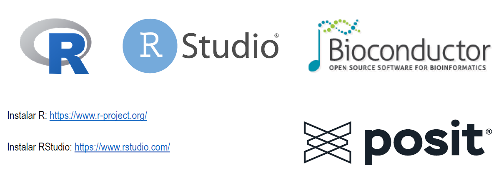
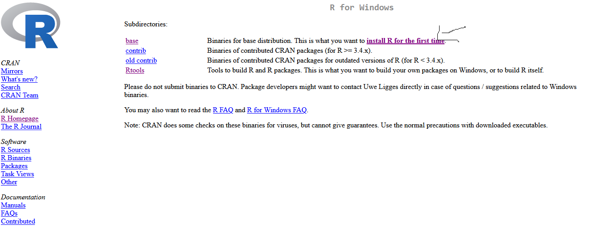
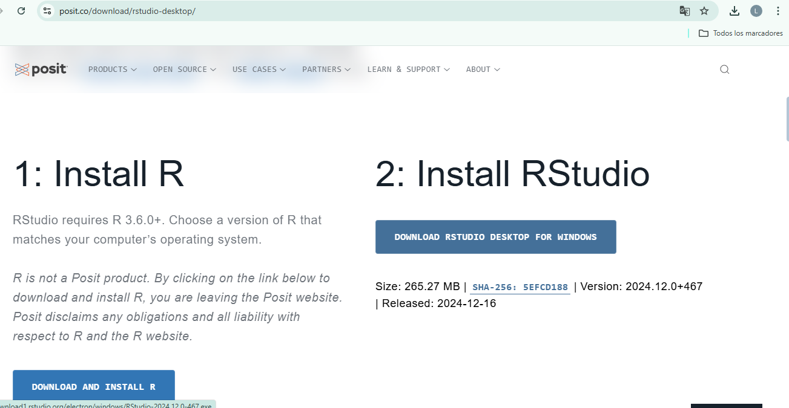
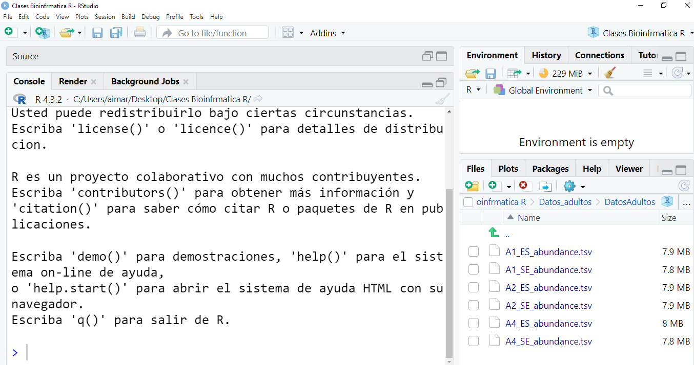
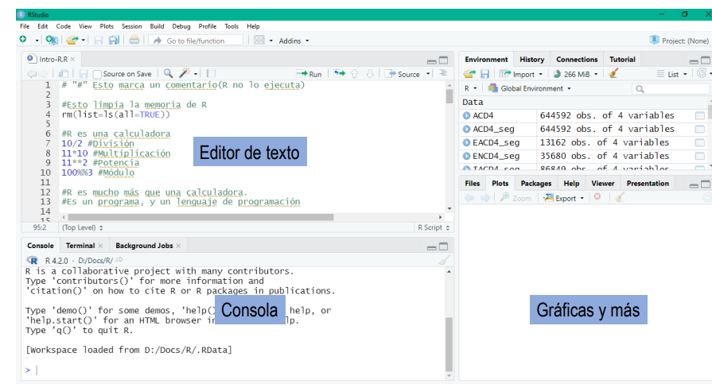
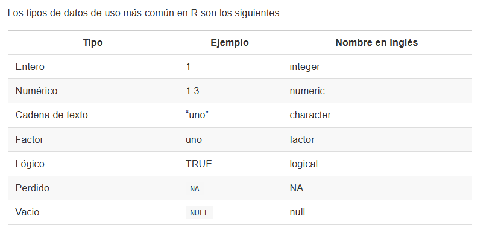

## El entorno de R

**R es un lenguaje de programación y un entorno para el análisis estadístico y gráficas de datos**

- R (Ihaka y Gentleman) puede considerarse derivado del lenguaje S (Chambers)
- Almacenamiento y manipulación de datos
- Operadores para cálculo sobre variables indexadas (arrays) y matrices
- Amplia colección de herramientas para análisis de datos
- Capacidades gráficas
- Lenguaje de programación con condicionales, ciclos y funciones
- Multiplataforma y de acceso libre

---



Instalar R: https://www.r-project.org  
Instalar RStudio / Posit: https://posit.co

---

## Instalando R



---

## Instalar RStudio / Posit



---

## Panel de RStudio / Posit



---

## Entorno de RStudio



---

R opera de la siguiente forma: **leer → evaluar → mostrar**

```{r}
2 + 2
```

---

## Datos más comunes



---

## Verificar el tipo de un dato

```{r eval=FALSE}
class(3)
class("3")
class(TRUE)
```

---

## Paquetes en R

```{r eval=FALSE}
install.packages("ggplot2")
```

---

## Bibliografía

https://swcarpentry.github.io/r-novice-gapminder-es/04-data-structures-part1.html  
https://bookdown.org/jboscomendoza/r-principiantes4/tipos-de-datos.html
