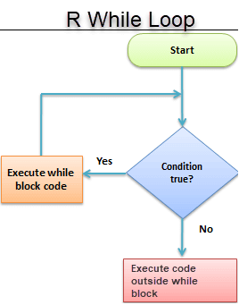

# Funciones

## Funciones  
¿Qué es una función en programación?
  
Una función tiene:
  
📛 un nombre

📦 uno o más argumentos

🧱 un cuerpo que define lo que hace

📌 ¿Cómo se define una función?
  
  Las funciones definidas por el usuario se crean usando la siguiente estructura:


```{r}
# suma <- function(x, y) {
#  resultado <- x + y
#  return(resultado)
#  }
```

Partimos del algoritmo para calcular el área de un cuadrilátero: lado x lado.

Podemos convertir esto a operaciones de R y asignarlas a una función llamada area_cuad

```{r}
area_cuad <- function(lado1,lado2) {
  lado1 * lado2
}
```

```{r}
area_cuad(lado1 = 4, lado2 = 6)
area_cuad(4, 6)

```


## if, else
.pull-left[
**if** (si) es usado cuando queremos que una operación se ejecute únicamente cuando una condición se cumple.
]
.pull-right[**else** (de otro modo) es usado para indicarle a R qué hacer en caso de la condición de un if no se cumpla.
]

Un if es la manera de decirle a R:

<mark>SI esta condición es cierta, ENTONCES haz estas operaciones.</mark>.

El modelo para un if es:

```{r}
# if(Condición) {
# operaciones_si_la_condición_es_TRUE
# }
```

Si la condición se cumple, es decir, es verdadera (TRUE), entonces se realizan las operaciones. En caso contrario, no ocurre nada y el código con las operaciones no es ejecutado.

Por ejemplo, le pedimos a R que nos muestre el texto “Verdadero” si la condición se cumple.

```{r}
# Se cumple la condición y se muestra "verdadero"
if(10 > 5) {
  "Verdadero"
}
```

```{r}
# No se cumple la condición y no pasa nada
if(4 > 5) {
  "Verdadero"
}
```


**else** complementa un if, pues indica qué ocurrirá cuando la condición no se cumple, es falsa (FALSE), en lugar de no hacer nada.


Un **if** con **else** es la manera de decirle a R:


<mark>***SI esta condición es es cierta, ENTONCES haz estas operaciones, DE OTRO MODO haz estas otras operaciones.***</mark>

El modelo para un if con un else es:

```{r}
# if(condición) {
#  operaciones_si_la_condición_es_TRUE
# } else {
#   operaciones_si_la_condición_es_FALSE
# }
```
## Agregando el else
```{r}
# Se cumple la condición y se muestra "Verdadero"
if(4 > 5) {
  "Verdadero"
} else {
  "Falso"
}
```

```{r}
# No se cumple la condición y se muestra "Falso"
if(4 > 5) {
  "Verdadero"
} else {
  "Falso"
}
```


## Stop 
```{r}
dividir <- function(a, b) {
  if (b == 0) {
    stop("Error: No se puede dividir por cero.")
  }
  return(a / b)
}

# Uso:
# dividir(10, 0) # Lanza error: Error: No se puede dividir por cero.

```


## Usando if y else

🎯 Objetivo:
Para ejemplificar el uso de **if / else**, crearemos una función que calcule el promedio de calificaciones de un estudiante y, según el resultado, muestre un mensaje específico 📩.

🔧 Paso 1. Definir función de promedio
Primero creamos una función que calcule el promedio usando la función base mean() de R 📊. Más adelante la ampliaremos para incluir lógica condicional.

```{r}
# nombre <- function(argumentos) {
# operaciones
# }
```

```{r}
promedio <- function(calificaciones) {
  mean(calificaciones)
}

promedio(c(6, 7, 8, 9))
```

## Ejemplos

Si asumimos que un estudiante necesita obtener 6 o más de promedio para aprobar, podemos decir que:

SI el promedio de un estudiante es igual o mayor a 6, ENTONCES mostrar “Aprobado”, DE OTRO MODO, mostrar “Reprobado”.
Aplicamso esta lógica con un if, else en la función promedio()

```{r}
promedio <- function(calificaciones) {
  media <- mean(calificaciones)
  if(media >= 6) {
    "Aprobado"
  } else {
    "Reprobado"
  }
}
promedio <- function(calificaciones){
  media <-mean(calificaciones)
  if(media >=6){
    "Aprobado"
  } else{
    "Reprobado"
  }
}
promedio(c(6, 7, 8, 9, 5))

```

Está funcionando, aunque los resultados podrían tener una mejor presentación.

Usaremos la función paste0() para pegar el promedio de calificaciones, como texto, con el resultado de “Aprobado” o “Reprobado”. Esta función acepta como argumentos cadenas de texto y las pega (concatena) entre sí, devolviendo como resultado una nueva cadena

```{r}
promedio <- function(calificaciones) {
  media <- mean(calificaciones)
  texto <- paste0("Calificación: ",media,", ")
  if(media >= 6) {
    paste0(texto, "aprobado")
  } else {
    paste0(texto, "reprobado")
  }
}
promedio(c(5, 8, 5, 6, 5))

```

## paste0 o paste
```{r}
#Une las cadenas e incluye un separador entre ellas.

cadena1 <- "Machine"
cadena2 <- "Learning"
resultado <- paste0(cadena1,cadena2)
resultado
```

```{r}
#Funciona de manera similar a paste(), pero no incluye ningún separador entre las cadenas.

cadena1 <- "Data"
cadena2 <- "Science"
resultado <- paste0(cadena1, cadena2)
resultado
```

## ifelse
🔁 La función **ifelse()** en R nos permite vectorizar la lógica de if / else, es decir, <mark>aplicar una condición a todos los elementos de un vector sin necesidad de escribir múltiples sentencias.</mark>

📌 Cuando intentamos usar una estructura tradicional de **if / else** con un vector, R solo evalúa el primer elemento y muestra una advertencia, porque **if** espera una sola condición lógica.

⚡ En cambio, con ifelse() obtenemos directamente un resultado para cada elemento del vector según si cumple o no la condición.

```{r}
# if(1:10 < 3) {
#   "Verdadero"
# }
## Warning in if (1:10 < 3) {: la condición tiene longitud > 1 y sólo el
## primer elemento será usado
```

En cambio, con ifelse se nos devolverá un valor para cada elemento de un vector en el que la condición sea TRUE, además nos devolverá otro valor para los elementos en que la condición sea FALSE

```{r}
# ifelse(vector, valor_si_TRUE, valor_si_FALSE)

```

## ifelse

```{r}
ifelse(1:10 < 3,"Verdadero","Falso")
```

```{r}
#Por ejemplo, pedimos sólo los números que son exactamente divisibles entre 2 y 3.

num <- 1:20

ifelse(num %% 2 == 0 & num %% 3, "Divisible", "No divisible")
```
## Ejemplo ifelse y dataframe

```{r}
#Desde luego, esto es particularmente útil para recodificar datos.

tabla_estudiantes <- data.frame(
  Estudiantes=c("Ron","Jake","Ava","Sophia","Mia"),
  Calificaciones=c(3.5,7.5,4.5,3.0,8.5))

tabla_estudiantes

tabla_estudiantes$Resultado =   
  ifelse(tabla_estudiantes$Calificaciones>6,
         "Aprobado","Reprobado")

tabla_estudiantes

```

## Ejercicio
```{r}
# Create dataframe
df <- data.frame(id=c(11,22,33,44,55),
                        pages=c(32,45,33,22,56),
                        name=c("spark","python","R","java","jsp"),
                        chapters=c(76,86,11,15,7),
                        price=c(144,553,321,567,890))
df


```
Agrega una nueva columna al dataframe para saber si el libro es pequeño (Small) o grande(Big).
Sera pequeño si tiene menos de 20 capítulos  y más de 10 páginas

```{r}
df$size <- ifelse(df$pages>10 & df$chapters<20,"SMALL","BIG")
df
```

## Sentencia for
La instrucción for itera por los elementos de un vector o lista, ejecutando un conjunto de instrucciones en cada iteración. Su sintaxis es:

```{r}
# for (item in vector) {
#   conjunto_de_instrucciones
# }

# for (i in lista) {
  # Código
# }
```

```{r}
for (x in c(20, 4, 6)) {
  print(x)
}

```

```{r}
for (alumno in tabla_estudiantes$Estudiantes) {
  print(alumno)
}
```

## Ejercicio

- Realiza un lista de tus frutas favoritas
- Crea un ciclo for para leer la lista
- El ciclo for debe regresar cada fruta de la lista

```{r}
fruits <- list("apple", "banana", "grape")
for (x in fruits) {
  print(x)
}
```

```{r}
for (x in fruits) {
  if (x == "banana") {
    break
  }
  print(x)
}
```

## Sentencia While
Este es un tipo de bucle que ocurre mientras una condición es verdadera (TRUE). La operación se realiza hasta que se se llega a cumplir un criterio previamente establecido.
```{r}
# while(condicion) {
#  operaciones
# }
```
Probemos sumar +1 a un valor, mientras que este sea menor que 5. Al igual que con for, necesitamos la función print() para mostrar los resultados en la consola.

```{r}
umbral <- 5
valor <- 0

while(valor < umbral) {
  print("Todavía no.")
  valor <- valor + 1
}
```




## Ejemplo While
### Simulación de crecimiento de una población de células en cultivo

Imagina que cada hora las células en cultivo aumentan su número en un 30 % debido a la división celular. Queremos simular cuántas horas pasan hasta que la población supera cierto umbral, por ejemplo 50 000 células.

```{r}
# Crecimiento celular simulado
poblacion <- 100     # Población inicial
objetivo <- 50000
horas <- 0

while (poblacion < objetivo) {
  poblacion <- poblacion * 1.3  # Crecimiento del 30%
  horas <- horas + 1
}
mensaje <- paste0(
  "Horas necesarias: ", horas, 
  " |Población final: ", round(poblacion))
mensaje
```
## Cálculo de la tasa de metabolismo basal

La Tasa de Metabolismo Basal (TMB), es la cantidad mínima de energía que necesita tu
cuerpo para funcionar. Nunca debemos ingerir menos cantidad de calorías de las que
marca la tasa metabólica. La TMB se calcula siguiendo las siguientes ecuaciones
TMB Mujer = 655 + (9.6 * P) + (1.8 * A) – (4.7 * E)
TMB Hombre = 66 + (13.7 * P) + (5 * A) – (6.8 * E)
donde necesitamos información del Sexo, A=Altura, P=Peso y E=Edad de cada persona, nuestros argumentos.

##📌 Instrucciones del ejercicio:

1. Escribe una función en R llamada calcularTMB() que reciba cuatro argumentos:
  * sexo (carácter: "hombre" o "mujer")
  * peso (numérico, en kg)
  * altura (numérico, en cm)
  * edad (numérico, en años)

2. Dentro de la función, utiliza if / else o ifelse() para decidir qué fórmula aplicar según el valor de sexo.

3. La función debe retornar el valor de la TMB calculado.

4. Luego de definirla, prueba tu función con estos datos:

  * Persona A: "mujer", peso = 70 kg, altura = 168 cm, edad = 38 años

  * Persona B: "hombre", peso = 78 kg, altura = 167 cm, edad = 40 años

🔎 Opcional: modifica la función para que, además de retornar el valor numérico de la TMB, muestre un mensaje indicando la cantidad mínima de calorías que esa persona necesita, por ejemplo:

“ Tu TMB es 1451 kcal/día — no deberías consumir menos que esto.”

## Respuesta
```{r }
# 📊 Función para calcular TMB
calcularTMB <- function(sexo, peso, altura, edad) {
  
  # Convertir a minúsculas por si el usuario escribe "Hombre" o "MUJER"
  sexo <- tolower(sexo)
  
  # 🧠 Validar el sexo y aplicar la fórmula adecuada
  if (sexo == "hombre") {
    # Fórmula para hombre
    tmb <- 66 + (13.7 * peso) + (5 * altura) - (6.8 * edad)
  } else if (sexo == "mujer") {
    # Fórmula para mujer
    tmb <- 655 + (9.6 * peso) + (1.8 * altura) - (4.7 * edad)
  } else {
    stop("⚠️ Sexo no válido. Usa 'hombre' o 'mujer'.")
  }
  
  # Retornar el resultado
  #return(tmb)
  return(paste(
  "Tu TMB es", tmb,
  "kcal/día — no deberías consumir menos que esto.")
  )

}
```

```{r}
# ♀️ Mujer de ejemplo
tmb_mujer <- calcularTMB("mujer", 70, 168, 38)
tmb_mujer
# ♂️ Hombre de ejemplo
tmb_hombre <- calcularTMB("hombre", 78, 167, 40)
tmb_hombre
```
## Referencias

- [Estructuras de control](https://bookdown.org/jboscomendoza/r-principiantes4/estructuras-de-control.html)
- [Ejemplo práctico](https://rpubs.com/ydmarinb/429756)
- [grepl y grep](https://r-coder.com/grepl-grep-en-r/)
- [sub y gsub](https://www.digitalocean.com/community/tutorials/sub-and-gsub-function-r)
