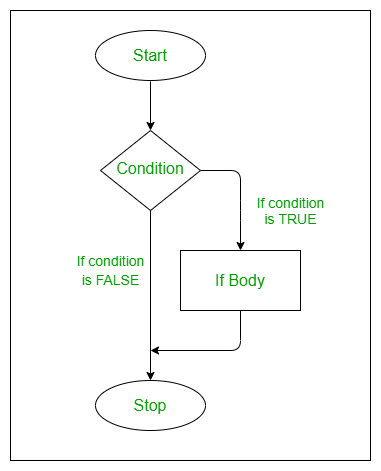

# Funciones
  
  ¿Qué es una función en programación?
  
  Una función tiene:
  
  📛 un nombre

📦 uno o más argumentos

🧱 un cuerpo que define lo que hace

📌 ¿Cómo se define una función?
  
  Las funciones definidas por el usuario se crean usando la siguiente estructura:

```{r eval=FALSE}
suma <- function(x, y) {
  resultado <- x + y
  return(resultado)
}
```

  Partimos del algoritmo para calcular el área de un cuadrilátero: lado x lado.

Podemos convertir esto a operaciones de R y asignarlas a una función llamada area_cuad


```{r}
area_cuad <- function(lado1,lado2) {
  lado1 * lado2
}
```

```{r}
area_cuad(lado1 = 4, lado2 = 6)
area_cuad(4, 6)

```

  class: inverse, middle, center

# if, else


## if, else
  .pull-left[
    **if** (si) es usado cuando queremos que una operación se ejecute únicamente cuando una condición se cumple.
  ]
.pull-right[**else** (de otro modo) es usado para indicarle a R qué hacer en caso de la condición de un if no se cumpla.
]

Un if es la manera de decirle a R:
  
  <mark>SI esta condición es cierta, ENTONCES haz estas operaciones.</mark>.

El modelo para un if es:
  
```{r eval=FALSE}
if(Condición) {
  operaciones_si_la_condición_es_TRUE
}
```

Si la condición se cumple, es decir, es verdadera (TRUE), entonces se realizan las operaciones. En caso contrario, no ocurre nada y el código con las operaciones no es ejecutado.

  Por ejemplo, le pedimos a R que nos muestre el texto “Verdadero” si la condición se cumple.

```{r}
# Se cumple la condición y se muestra "verdadero"
if(10 > 5) {
  "Verdadero"
}
```

```{r}
# No se cumple la condición y no pasa nada
if(4 > 5) {
  "Verdadero"
}
```


**else** complementa un if, pues indica qué ocurrirá cuando la condición no se cumple, es falsa (FALSE), en lugar de no hacer nada.


Un **if** con **else** es la manera de decirle a R:
  
  
<mark>***SI esta condición es es cierta, ENTONCES haz estas operaciones, DE OTRO MODO haz estas otras operaciones.***</mark>
  
El modelo para un if con un else es:
  
```{r eval=FALSE}
if(condición) {
  operaciones_si_la_condición_es_TRUE
} else {
  operaciones_si_la_condición_es_FALSE
}
```
Agregando el else
```{r}
# Se cumple la condición y se muestra "Verdadero"
if(4 > 5) {
  "Verdadero"
} else {
  "Falso"
}
```

```{r}
# No se cumple la condición y se muestra "Falso"
if(4 > 5) {
  "Verdadero"
} else {
  "Falso"
}
```


  
  ##Stop
```{r}
dividir <- function(a, b) {
  if (b == 0) {
    stop("Error: No se puede dividir por cero.")
  }
  return(a / b)
}

# Uso:
# dividir(10, 0) # Lanza error: Error: No se puede dividir por cero.

```


  
  
## Usando if y else
  
  🎯 Objetivo:
  Para ejemplificar el uso de **if / else**, crearemos una función que calcule el promedio de calificaciones de un estudiante y, según el resultado, muestre un mensaje específico 📩.

🔧 Paso 1. Definir función de promedio
Primero creamos una función que calcule el promedio usando la función base mean() de R 📊. Más adelante la ampliaremos para incluir lógica condicional.

```{r eval=FALSE}
nombre <- function(argumentos) {
  operaciones
}
```

```{r}
promedio <- function(calificaciones) {
  mean(calificaciones)
}

promedio(c(6, 7, 8, 9))
```

  Si asumimos que un estudiante necesita obtener 6 o más de promedio para aprobar, podemos decir que:
  
  SI el promedio de un estudiante es igual o mayor a 6, ENTONCES mostrar “Aprobado”, DE OTRO MODO, mostrar “Reprobado”.
Aplicamso esta lógica con un if, else en la función promedio()

```{r}
promedio <- function(calificaciones) {
  media <- mean(calificaciones)
  if(media >= 6) {
    "Aprobado"
  } else {
    "Reprobado"
  }
}
promedio <- function(calificaciones){
  media <-mean(calificaciones)
  if(media >=6){
    "Aprobado"
  } else{
    "Reprobado"
  }
}
promedio(c(6, 7, 8, 9, 5))

```

  Está funcionando, aunque los resultados podrían tener una mejor presentación.

Usaremos la función paste0() para pegar el promedio de calificaciones, como texto, con el resultado de “Aprobado” o “Reprobado”. Esta función acepta como argumentos cadenas de texto y las pega (concatena) entre sí, devolviendo como resultado una nueva cadena

```{r}
promedio <- function(calificaciones) {
  media <- mean(calificaciones)
  texto <- paste0("Calificación: ",media,", ")
  if(media >= 6) {
    paste0(texto, "aprobado")
  } else {
    paste0(texto, "reprobado")
  }
}
promedio(c(5, 8, 5, 6, 5))

```


## paste0 o paste
```{r}
#Une las cadenas e incluye un separador entre ellas.

cadena1 <- "Machine"
cadena2 <- "Learning"
resultado <- paste0(cadena1,cadena2)
resultado
```

```{r}
#Funciona de manera similar a paste(), pero no incluye ningún separador entre las cadenas.

cadena1 <- "Data"
cadena2 <- "Science"
resultado <- paste0(cadena1, cadena2)
```


class: inverse, middle, center

#ifelse

  ##ifelse
  🔁 La función **ifelse()** en R nos permite vectorizar la lógica de if / else, es decir, <mark>aplicar una condición a todos los elementos de un vector sin necesidad de escribir múltiples sentencias.</mark>
  
  📌 Cuando intentamos usar una estructura tradicional de **if / else** con un vector, R solo evalúa el primer elemento y muestra una advertencia, porque **if** espera una sola condición lógica.

⚡ En cambio, con ifelse() obtenemos directamente un resultado para cada elemento del vector según si cumple o no la condición.

```{r eval=FALSE}
if(1:10 < 3) {
  "Verdadero"
}
## Warning in if (1:10 < 3) {: la condición tiene longitud > 1 y sólo el
## primer elemento será usado
```
