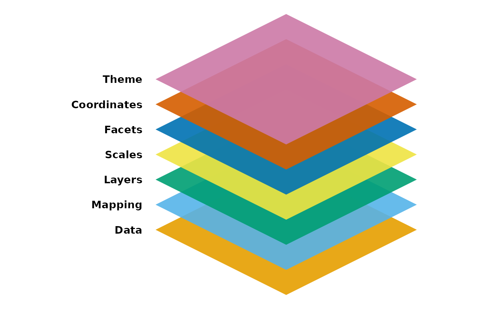
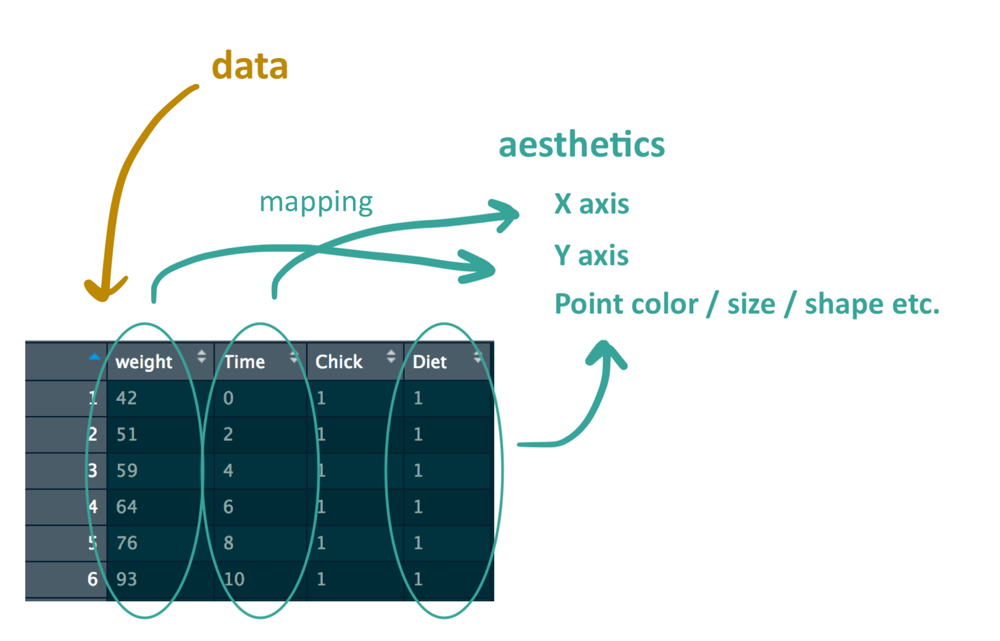
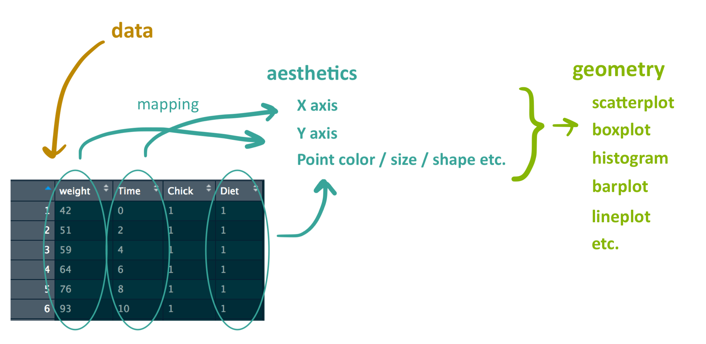
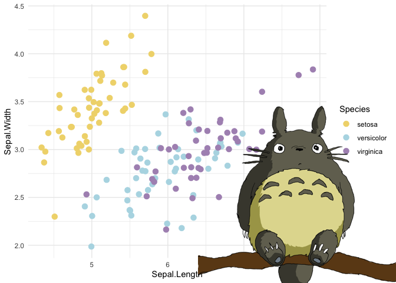
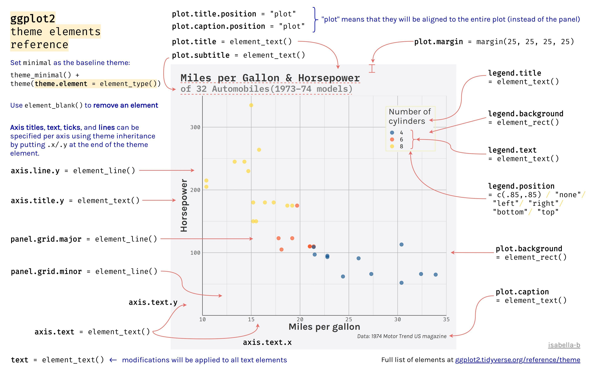
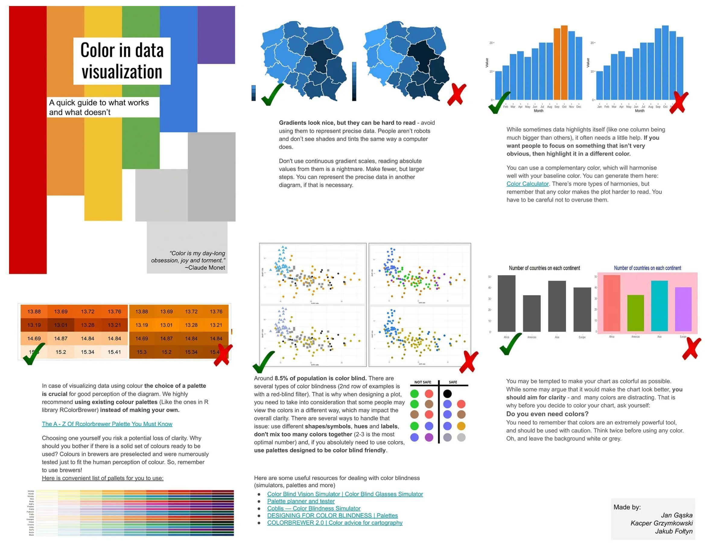
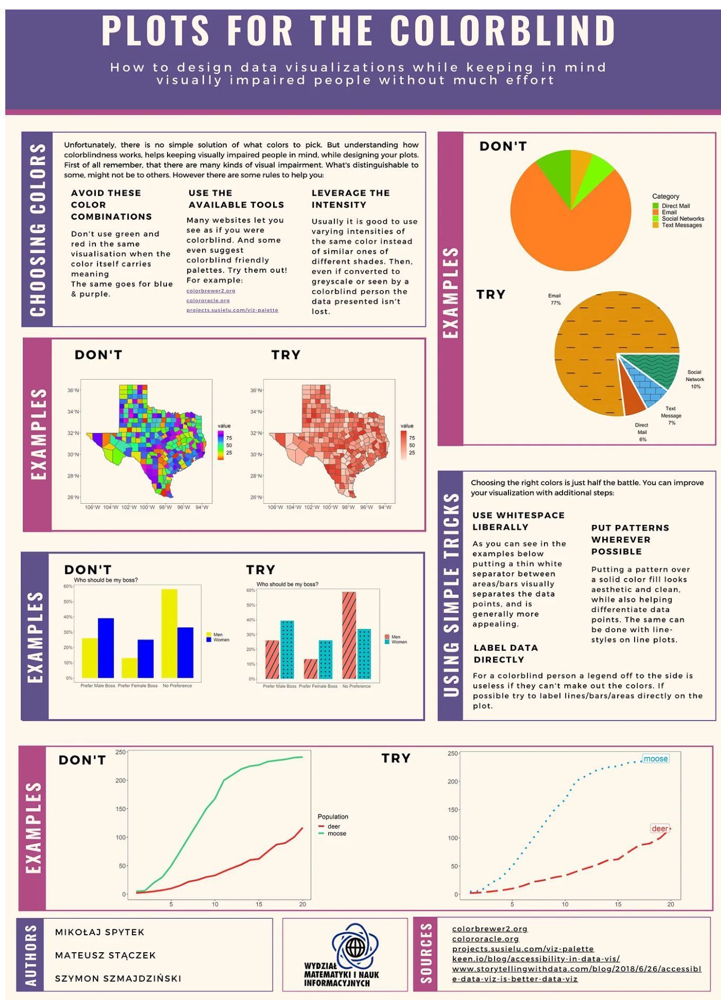

# ggplot2

{width="50%"} [Guía rápida de ggplot2 (cheatsheet)](https://github.com/rstudio/cheatsheets/blob/main/data-visualization.pdf)

## ggplot2

El término gg, viene de “grammar of graphics”. set de componentes: - data = debe ser un data.frame - aesthetics: cómo se representarán visualmente los datos en términos ejes (x,y), color, tamaño, forma, etc. - geometry: Geometría de los objetos a graficar, Puntos,Líneas,Etc.

```{=html}

```

## data

```{r}
# Load data
library(ggplot2)
data(ChickWeight)
head(ChickWeight)
summary(ChickWeight)

```

## aesthetics

Esto incluye cosas como qué variable va en el eje X, qué variable va en el eje Y y qué tamaño, forma o color desea para sus puntos/líneas/barras/etc. ggplot2_image2 

## geometry

Una vez que definimos cómo asignar los datos a elementos estéticos de nuestra elección, la forma en que presentamos los datos es utilizando un objeto geométrico, el cual puede ser un diagrama de dispersión, un diagrama de caja, un diagrama de líneas, etc. 

## theme

Te permite decidir cómo se ve el gráfico en términos de como el color, fuente de letra, tamaño de fuente. Si no los especifica, ggplot simplemente usará la configuración predeterminada. \### Ejemplo Digamos que queremos crear un diagrama de dispersión que muestre el peso versus el tiempo de estos polluelos.

```{r}
#ggplot(ChickWeight)
```

```{r}
#ggplot(data, aes(x, y))
ggplot(ChickWeight, aes(x = Time, y = weight))
```

## Bar plot

```{r,fig.height = 5}
# Crea un bar plot con ggplot2
ggplot(ChickWeight, aes(x = Time, y = weight))+
  geom_col()
```

## Box plot

```{r,fig.height = 5}
# Crea un box plot con ggplot2
ggplot(ChickWeight, aes(x = Diet, y = weight))+
  geom_boxplot()
```

## scatter plot

```{r,fig.height = 5}
#ggplot(data, aes(x, y))
ggplot(ChickWeight, aes(x = Time, y = weight))+
  geom_point()
```

```{r}
ggplot(ChickWeight, aes(x = Time, y = weight,color = Diet)) +
  geom_point()

```

### Modificar el tamaño de los puntos con size

```{r,fig.height = 5}
ggplot(ChickWeight, aes(x = Time, y = weight,color = Diet)) +
  geom_point(size=5)
```

### Modificar el tamaño en función del peso

```{r,fig.height = 5}
ggplot(ChickWeight, aes(x = Time, y = weight,color = Diet,size = weight)) +
  geom_point()
```

### Figuras en multiples paneles face_grid

```{r,fig.height = 5}
ggplot(ChickWeight, aes(x = Time, y = weight,color = Diet)) +
  geom_point()+ facet_grid(~Diet)
```

## Cambiar la transparencia con alpha

```{r,fig.height = 5}
ggplot(ChickWeight, aes(x = Time, y = weight,color = Diet,size=weight)) +
  geom_point(alpha = 0.5)
```

### Cambiar los simblos con respecto a la dieta con shape

```{r,fig.height = 5}
ggplot(ChickWeight, aes(x = Time, y = weight,color = Diet,
size=weight,shape=Diet))+ 
  geom_point()
```

## Formas de puntos en R


```{r}
ggplot(ChickWeight, aes(x = Time, y = weight,size=weight)) + geom_point(shape=23)
```

```{r}
fig <-ggplot(ChickWeight, aes(x = Time, y = weight,color = Diet)) +
  geom_point(aes(shape= Diet)) +
scale_shape_manual(values=c(3, 16, 17, 6)) +  scale_color_manual(values=c('#999999','#E69F00', '#56B4E9','pink'))
fig
```

## Seleccionar colores con una paqueteria

### R charts

-   https://r-charts.com/colors/

```{r, fig.height = 8}
#RColorBrewer tiene una bonita paleta de colores. install.packages("RColorBrewer").
library(RColorBrewer)
display.brewer.all()
```

-   scale_fill_brewer() for box plot, bar plot, violin plot, dot plot, etc
-   scale_color_brewer() for lines and points

```{r}
fig2<-ggplot(ChickWeight, aes(x = Time, y = weight,color = Diet)) +
  geom_point(size = 4)+ scale_color_brewer(palette = "Dark2")
fig2

```

## Paleta magica con ghibli

-   https://github.com/ewenme/ghibli/tree/master?tab=readme-ov-file



```{r}
#install.packages('ghibli')
# load package
library(ghibli)
ghibli_palettes$TotoroMedium
```

## ｡◕‿‿◕｡ Espolvorea un poco de la magia de la paleta de Studio Ghibli sobre tus gráficas ｡◕‿‿◕｡

```{r, fig.height=5}
# display palettes w/ names
par(mfrow=c(9,3))
for(i in names(ghibli_palettes)) print(ghibli_palette(i))
```

```{r}
##scale_[colour|fill]_ghibli_[c|d]()
fig3<-ggplot(ChickWeight, aes(x = Time, y = weight,color = Diet)) +
  geom_point(size = 4)+ # ghibli stuff
  scale_colour_ghibli_d("MarnieMedium1", direction = -1)
fig3
```

#### Títulos con ggtitle

```{r}
##scale_[colour|fill]_ghibli_[c|d]()
fig4<-ggplot(ChickWeight, aes(x = Time, y = weight,color = Diet)) +
  geom_point(size = 4)+ # ghibli stuff
  scale_colour_ghibli_d("MarnieMedium1", direction = -1) + ggtitle("Datos de la prueba de la dieta en pollitos ") + ylab("Peso de los pollitos(gm)") +
xlab("Tiempo(d)")
```


```{r}
fig4
```

  ####Modificar el estilo de la etiquetas y ejes con theme y labs
  - https://ggplot2.tidyverse.org/reference/theme.html


```{r}
fig4 + theme(legend.title = element_text(face = "bold.italic",colour="blue",size=14))
```


```{r}
#install.packages('extrafont')
#library(extrafont)
#font_import()
#loadfonts(device = "win")
#fonts()
fig5 <- fig4 + theme(plot.title=element_text(hjust=0.5,size=15,family="Comic Sans MS",face="bold.italic",colour="red"))

```


```{r,warning=FALSE} 
fig5
```

```{r} 
#install.packages("cowplot")
library(cowplot)
cowplot::plot_grid(fig,fig2,fig3,fig4, labels = c('A)','B)','C)','D)')) #nrow=4
#figura_convertida<-as.ggplot(figura_que_no_se_genero_con_ggplot2)
```

  
## Guardar la imagen con ggsave
- https://ggplot2.tidyverse.org/reference/ggsave.html
- Si la figura que generaste no fue realizada con ggplot 2,conviértela con as.ggplot
figura_convertida<-as.ggplot(figura_que_no_se_genero_con_ggplot2)
```{r} 
ggsave("Imagenes/plot.png", fig5, width = 5, height = 5)

```




  
  
# plotly
Plotly (https://plot.ly/) es un servicio comercial y un producto de código abierto para crear visualizaciones interactivas de alta gama. 
El paquete plotly permite crear gráficos interactivos plotly desde dentro de R. 
Además, cualquier gráfico ggplot2 se puede convertir en un gráfico plotly.

```{r} 
#install.packages("plotly")
library(plotly)

```

  
```{r}
ggplotly(fig4)
```

```{r}
# create plotly graph.
library(plotly)
library(dplyr)

mpg <- mpg %>%
  mutate(mylabel = paste("This is a", manufacturer, model, "\n",
                         "released in", year, "."))

p <- ggplot(mpg, aes(x=displ, 
                     y=hwy, 
                     color=class,
                     text = mylabel)) +
  geom_point(size=3) +
  labs(x = "Engine displacement",
       y = "Highway Mileage",
       color = "Car Class") +
  theme_bw()

```

  
```{r,fig.height = 5}
ggplotly(p, tooltip = c("mylabel"))

```


## Barplot
*Libreria palmerpenguins* 
## 🐧 Palmer Penguins

Dataset ideal para aprender visualización en R.

- 3 especies de pingüinos
- Datos reales de la Antártida
- Alternativa moderna a `iris`

🔗 [Explorar dataset](https://allisonhorst.github.io/palmerpenguins/)


```{r,fig.height = 5,message=FALSE,warning=FALSE}

library(palmerpenguins)

ggplot(penguins, aes(x = species))+ geom_bar()

```

## Barplot

```{r,fig.height = 5}
# plot the distribution of race with modified colors and labels
ggplot(penguins,aes(x = species,fill = species)) + geom_bar() + labs(x = "Species", y = "Frequency",title = "Penguins")
```

## Barplot
  
```{r,fig.height = 5}
# plot the distribution as percentages
ggplot(penguins, aes(x = species,fill = species, y = after_stat(count/sum(count)))) + geom_bar() + labs(x = "Species", y = "Percent", title  = "Penguins") + scale_y_continuous(labels = scales::percent)

```

## Barplot

```{r, fig.height = 5}
ggplot(penguins, 
       aes(x = species,fill=species, y = after_stat(count/sum(count)))) + 
  geom_bar() +
  labs(x = "Species", 
       y = "Percent", 
       title  = "Penguins") +
  scale_y_continuous(labels = scales::percent)+  coord_flip()

```

## Barplot

```{r,fig.height = 5}
ggplot(penguins, 
       aes(x = species,fill=species, y = after_stat(count/sum(count)))) + 
  geom_bar() +
  labs(x = "Species", 
       y = "Percent", 
       title  = "Penguins") +
  scale_y_continuous(labels = scales::percent)+
  theme(axis.text.x = element_text(angle = 45,
                                   hjust = 1))
```

## Pie chart
  
``` {r,fig.height = 5}
# create a basic ggplot2 pie chart
#if(!require(remotes)){
#   install.packages("remotes")
#}
#remotes::install_github("rkabacoff/ggpie")
library(ggpie)
ggpie(penguins, species,offset = 1.5,legend=FALSE,title="% de especies")
```


```{r,fig.height = 5}
ggpie(penguins, species,offset = 1.5,legend=F,title="% de especies") +
  scale_fill_brewer(palette="Set1") +
  theme(legend.position = "top")

```


## ¿Cuál es la distribución porcentual de las especies de pingüinos en cada isla del conjunto de datos penguins?

```{r,fig.height=5}
ggpie(penguins,species,island, 
      offset=1.3, 
      label.size=3,
      legend=FALSE, 
      title="% de especies por isla")
```
## 🥧 Pie chart en ggplot2

[Ver tutorial de ggpie](https://rkabacoff.github.io/ggpie/articles/ggpie.html)

## 📊 Recursos ggplot2

### Introducción
- [Intro ggplot2](https://www.rforecology.com/post/a-simple-introduction-to-ggplot2/)
- [Tutorial completo](https://r-statistics.co/Complete-Ggplot2-Tutorial-Part1-With-R-Code.html)

### Libro
- [ggplot2 book](https://ggplot2-book.org/getting-started)

### Datos
- [ChickWeight dataset](https://www.rdocumentation.org/packages/datasets/versions/3.6.2/topics/ChickWeight)

### Personalización
- [Shapes](http://www.sthda.com/english/wiki/ggplot2-point-shapes)
- [theme()](https://ggplot2.tidyverse.org/reference/theme.html)

### Avanzado
- [Fuentes](https://github.com/wch/fontcm)
- [Interactividad ggiraph](https://rkabacoff.github.io/datavis/Interactive.html#ggiraph)
- [ggpie](https://cran.r-project.org/web/packages/ggpie/vignettes/ggpie.html)
